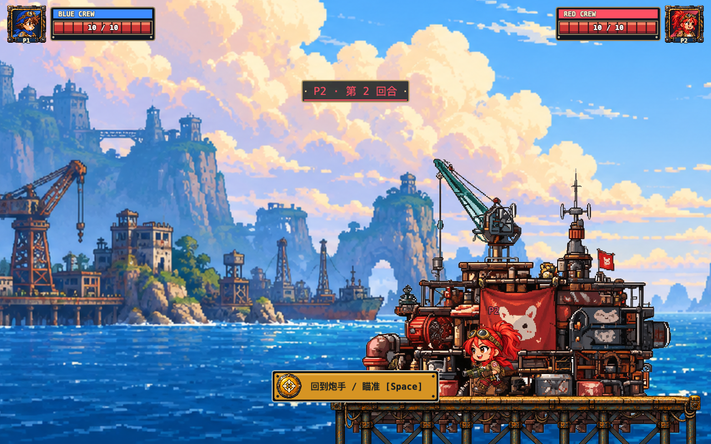
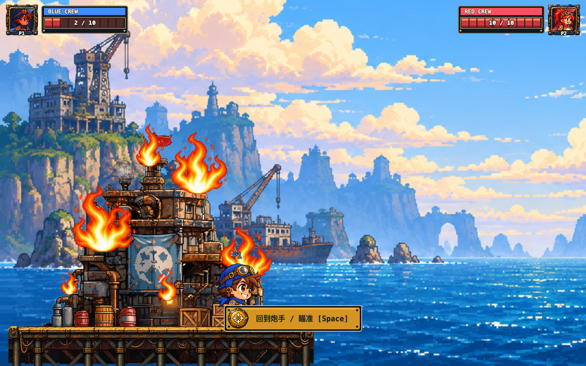
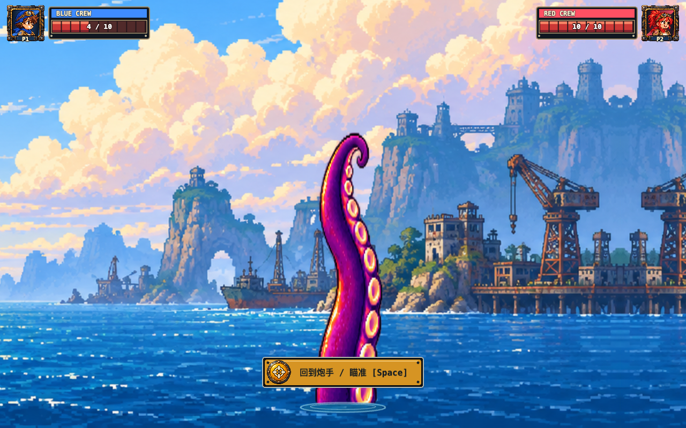

# 走路、基地火焰与触角动画精修

2026-09-30。沿用现有角色、基地及章鱼玩法，更新表现资源与播放逻辑。

## 新素材

均由内置 imagegen 制作，原生透明 PNG 直接导入 `public/assets/art/`。保留原图，用 BootScene 切帧；没有二次编辑像素。[完整提示词](ANIMATION_PROMPTS.md)。

| 文件 | 尺寸 / 网格 | 播放用途 |
| --- | --- | --- |
| blue-walk.png | 1774×887 / 4×2，单帧 443×443 | 蓝队 8 帧走路 |
| red-walk.png | 1774×887 / 4×2，单帧 443×443 | 红队 8 帧走路 |
| base-fire-varied.png | 1254×1254 / 4×4，单帧 313×313 | 0–7 小火、8–15 大火 |
| octopus-flex.png | 1254×1254 / 4×4，单帧 313×313 | 16 帧触角卷曲 |

原始生成输出位于本会话 `~/.codex/generated_images/01a0eb4a-a5ec-7620-844d-3ec40897d9bf/`，分别为：

- 蓝队：`exec-d3d82d50-69a9-4fbf-9fd4-2b1c8b094487.png`
- 红队：`exec-c1835882-5858-49a7-b581-037f2628016a.png`
- 火焰：`exec-1b1e37ac-4b7c-4e1f-a501-3630499bf78f.png`
- 触角：`exec-596b3ecd-3e49-4eb5-8952-29cc054e36d6.png`

## 接入方式

**走路**：从 PlayerState 的实际水平位移累计步态，每 12 世界像素切一帧，8 帧循环。按每帧实测鞋底设置 origin，采用固定高度比例保持头部尺寸；停止立即回待机，移动朝向控制翻转。菜单和头像保留原立绘。缺少图集时保留旧轻微起伏回退。碰撞、移动预算、命令与联机同步均未改动。

**火焰**：HP 10–9 完好、≤8 轻烟、≤6 浓烟沿用现有阈值；≤4 三处小火，≤2 六处大小火混合。落点纵向覆盖屋顶、窗口附近与甲板上方。小火 12 fps、大火 10 fps，各火点错开起始帧及播放速度，绘制在建筑前、角色后。HP 恢复时销毁旧档火焰。创建精灵时直接指定单帧，避免先按整张图集缩放导致显示缩小。

**触角**：任一方 HP≤4 时，从 `baseY+height+100` 向上移动到 baseY=1040，时长 1500ms，无整根透明渐显。使用 Phaser 4 WebGL 支持的精灵原生 setCrop 裁掉海面以下部分；动画换帧与入场 tween 同步刷新裁切；根部用局部泡沫和涟漪衔接，不恢复前景水面条带。升起后 16 帧 / 8 fps 循环，叠加轻微底枢慢摆。既有静态碰撞体仍在激活时建立，避免按视觉时钟改变双端物理规则；入场动画阶段碰撞已生效的原行为保持。

## 验证

- 类型检查与生产构建通过；500 项单测 / 44 文件通过。
- `node scripts/animation-acceptance.mjs` 桌面与手机横屏通过：蓝红双角色实际移动换帧/停步、P2 左向翻转、大小火档位/分布/恢复清理、触角向上升起与循环，未出现脚本错误或 WebGL 不支持警告。
- 原生裁切修复后的 `npm run e2e`：**147 passed / 0 failed**（桌面完整对局、移动端矩阵、AI、WebRTC 配对/对战、Desync 恢复、再战与断线）。无 PAGEERROR 或 WebGL 遮罩警告；联机日志仍含此前已记录的资源 404 提示，未定位具体 URL，不声明控制台完全无错误。
- 动画专项用真实键盘/触屏移动，并通过自然发射切到 P2；HP 注入仅用于快速检查火焰与触角表现，不作为自然对局证明。
- 真实设备观感和性能仍需 [Phase 18 QA](../PHASE18_DEVICE_QA.md)。走路以外的完整逐帧角色动作、独立视差层和 AI 绕避触角未包含在本轮。

## 浏览器截图

