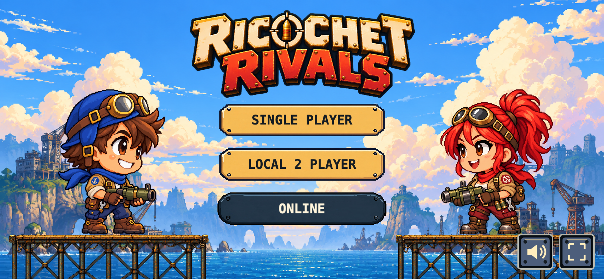
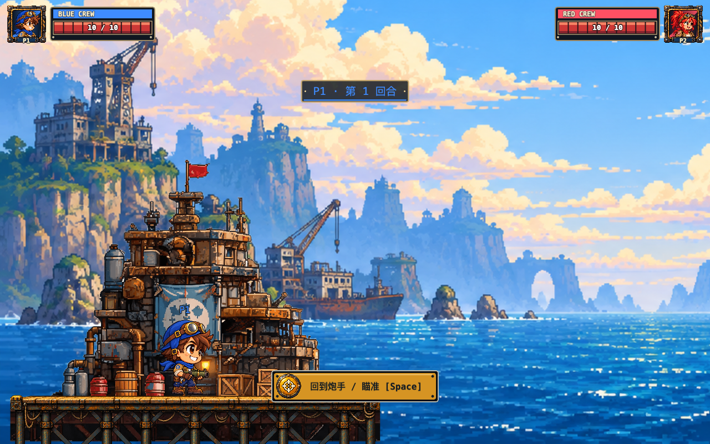

# 长支架与标题菜单精修

2026-09-29。在 Codely 已完成的基地火烟、章鱼障碍与 Phase 18 移动端加固基础上，按用户反馈调整基地落地感与标题页层级。

## 资源与落地

新增 `public/assets/art/dock-platform-tall.png`，通过内置 imagegen 编辑原 `dock-platform.png`，保留暖色甲板、铆钉、绳索与钢材风格，延长下部立柱和交叉撑。原始透明 PNG 1774×887；有效 frame 为 `(17,65,1739,759)`。原始输出：`exec-82d03634-e1c2-497a-bb00-afba739ef700.png`，位于本次会话本地 `~/.codex/generated_images/01a0eb4a-a5ec-7620-844d-3ec40897d9bf/`。

- 战场平台宽仍为 900 世界像素，等比高度约 393；顶部站立线保持 y=960。角色判定、移动范围与基地建筑沿用现有配置。
- 菜单与战场共用 `DOCK_ART_FRAME`，立柱延伸出屏幕底部；透明撑架间可见原海港背景。
- 移除 `water-strip.png` 的预加载和前景绘制。旧海水条带与短支架文件保留作历史素材，当前运行时不用。
- 标题最大宽度为桌面 680、短屏 340 CSS px，并受视口 64% 宽限制；模式按钮 244×52，字号 18。
- 声音与全屏图标为 48×48 CSS px，位于右下角安全区域内，间隔 10。声音有声波/静音斜线两态，全屏有进入/退出两态；监听浏览器全屏事件同步外部退出。
- 修复 Vite 预览路径：build 与 preview 均使用 `/Ricochet-Rivals/`，开发服务器仍使用根路径。

### 生成提示词

参考原码头平台，`transparent_background=true`：

> EDIT the attached dock-platform game sprite. Preserve the exact visual style and warm rusty wood/steel horizontal deck design, including golden planks, end caps, rivets and hanging ropes. The essential change: substantially EXTEND ALL VERTICAL SUPPORT LEGS DOWNWARD, making a tall load-bearing pier structure instead of the existing short floating platform. Add tall continuous vertical steel pilings under each existing post, and long diagonal X cross braces between posts. Pilings should extend down 4 times the height of the original under-deck structure. Keep the TOP DECK HORIZONTAL and thin; do not stretch or make the deck thicker. The asset should have a width to visible height ratio about 2.7:1. Straight orthographic side elevation. Transparent openings between braces. No sea or water anywhere, no background, no characters, no buildings, no ground, no painted shadows. True transparent alpha outside the structure. Whole object visible and centered with small margins; platform deck near the upper 10% of the canvas, long pylons extending almost to the bottom. Tall useful legs that can continue past the bottom of a game viewport. Pixel art detail consistent with supplied image, clean brown/dark teal steel palette. Wide 2:1 canvas.

实际生成比例以有效 frame 为准；没有拉伸甲板或对输出做二次像素编辑。

## 验证与边界

- `npm run typecheck`、`npm test`（44 文件 / 500 项）、`npm run build` 通过。
- `node scripts/art-acceptance.mjs`：桌面与手机尺寸均通过。覆盖声音图标切换、桌面全屏进入/退出、瞄准取消与射击、命中伤害、落海不扣血、结算和联机入口；无页面脚本错误。
- `npm run e2e`：**147 passed / 0 failed**，含完整桌面对局、两种手机尺寸、AI、真实 WebRTC 配对/对战、Desync 恢复与再战。联机日志另有未定位 URL 的资源 404 提示，不影响上述断言；不能据此声明控制台完全无错误。
- 仍需用户真机观感确认及 [Phase 18 设备 QA](../PHASE18_DEVICE_QA.md)。本轮未扩展逐帧角色动画或独立视差层。
- 发布目标为 Git `Dev`；仓库 Pages 自动部署仅监听 `main`，推送 `Dev` 不等于网站已更新。

## 实际浏览器截图

手机横屏模拟（844×390 CSS px，DPR 2）：

桌面战场：

