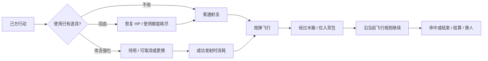

# Ricochet Rivals — V0.2 PRD

主题：空中补给与回合道具。

日期：2026-10-02。状态：开发实现已完成，自动验收记录见 [V0.2 QA](V0.2_QA.md)；真机与平衡试玩待完成。基线：已发布的 `v0.1.0`。目标发布版本：`0.2.0`；开发期间包版本仍为 `0.1.0`，尚未更新发布标签或部署。

## 1. 版本目标与范围

让玩家在每次射击前多做一个有意义的决定：直接攻击、沿另一条弹道收集补给，或消耗已有道具争取优势。道具增加选择，不替代拖拽瞄准，也不引入额外攻击次数。

V0.2 的主要新增内容是道具系统，以及它所需的界面、AI、联机同步和反馈。覆盖单人、本地双人、在线双人三种模式。

| 核心决定 | 本版方案 |
| --- | --- |
| 空中补给 | 降落伞悬挂木箱，箱面显示内容类型，双方均可争夺 |
| 获得方式 | 炮弹经过木箱即拾取；箱子不是实体障碍 |
| 持有上限 | 每方 3 格，每格 1 件，同类道具也分别占格 |
| 一发最多拾取 | 当前最多 2 箱，同时受背包剩余空格限制；跨回合最多持有 3 件 |
| 使用上限 | 每个己方行动回合最多成功使用 1 件，回血也占额度 |
| 五类道具 | 恢复 HP、威力加强、范围加强、自动瞄准 |
| 道具作用时机 | 回血立即生效；攻击类只强化本回合成功发射的这一颗炮弹 |

库存选 3 格：五类道具需要留存和取舍；2 格容易迫使玩家频繁放弃资源。3 格仍不能囤齐全部类型，配合每回合 1 件限制，不允许连按按钮叠出爆发。

本版不纳入旧 V0.1 PRD 中设想的风力、多武器、分裂弹、护盾、商店或随机地图。现有 `split`、`shield` 类型只是历史预留，不能据此扩大本次范围。

## 2. 实际玩法基线

本节按当前配置和实现确认，优先于旧 PRD 的历史建议值。

| 项目 | V0.1 当前行为 |
| --- | --- |
| 生命与攻击 | 10 HP；每次行动只能发射 1 次 |
| 基础伤害 | 爆心距受击矩形最近边缘 ≤60 世界 px：2；60～140 px：1；超过 140 px：0 |
| 移动 | 己方基地内自由水平移动，没有累计距离预算 |
| 世界与角色 | 5000×1080；脚底 y=960；角色判定体 120×180 |
| 双方位置 | P1/蓝方基地 x=100～850；P2/红方基地 x=4150～4900 |
| 炮弹 | 初速 550～2400 世界 px/s；半径 16；重力 1000 px/s²；寿命 8 秒 |
| 瞄准预览 | 12 点，显示最初 0.8 秒，不显示完整落点 |
| 章鱼 | 中场障碍，任一方 HP≤4 时在结算触发；15 HP；存活满 5 个行动后首次激光，之后攻击间隔 3 个行动回合 |
| AI | 开局选择简单、普通、困难；普通/困难瞄准身体并收紧误差 |
| 联机 | Host 权威结算；双端本地表现；快照对账、断线恢复和再战 |

下文“回合/行动”指一位玩家从行动到结算的一次操作；“完整轮”指双方各行动一次。例如行动 1、2 属于第 1 轮，行动 3、4 属于第 2 轮。不要把两种计数混用。

## 3. 玩家流程

1. 己方行动开始，观察场上木箱、敌方位置、双方 HP 和库存。
2. 选择普通射击，或点击一件已有道具。
3. 回血类成功使用后立即回血，本回合仍可普通射击；不能再使用攻击道具。
4. 攻击类先处于“本次射击待用”，允许取消或更换；成功发射才扣除。
5. 炮弹按所选效果飞行；经过木箱时收进背包，继续飞行。
6. 按现有规则撞击、爆炸、结算、处理章鱼事件，再进入对方行动。
7. 本次飞行中新获得的道具，最早在下一次己方行动使用。

“拾取不改变轨迹”指拾取事件本身不会改变炮弹的位置、速度、方向、重力或寿命。已在发射前使用的自动瞄准仍会按其规则在 0.8 秒转向；不能将这一转向错误归因于途中吃到箱子。

## 4. 空投生成与节奏

以下为首轮试玩参数，不是已验证的平衡结论。通过第 13 节的对照试玩后可调参。

### 4.1 生成规则

| 参数 | 初始值 |
| --- | --- |
| 第 1 完整轮 | 不生成，双方先完成一次基础射击 |
| 第 2 完整轮 | 在该轮的指定合格生成窗口必出 1 箱；无合法位置仍按跳过规则处理 |
| 第 3 轮及以后 | 每完整轮最多判定 1 次，基础生成概率 65%，成功出 1 箱 |
| 保底 | 连续 2 次合格窗口未生成，第 3 次必出 |
| 场上上限 | 同时最多 2 箱，不包含已收进背包的道具 |
| 箱子存续 | 自出现起可供 6 次玩家行动；第 6 次结算后、下一行动前消失 |
| 随机 | 由对局种子派生的道具专用序列；与 AI、章鱼随机独立 |

每轮有第一位、第二位行动者。第 2 轮用种子以 50%/50% 选其中一人的行动开始前作为生成窗口，之后逐轮交替。例：先选第一位，则窗口依次为行动 3、6、7、10……；先选第二位，则为 4、5、8、9……。这些是每轮的判定窗口，不代表每次必出箱子。

这样双方轮流先获得新补给的射击机会，避免所有空投固定在 P1 行动前出现。箱子无阵营归属；先看到不等于自动得到，仍需实际射击经过。

每次玩家行动开始前都先清理到期箱子，无论该行动是否为生成窗口。随后若是生成窗口，处理顺序为：检查场上数量及两个区域的合法候选 → 概率/保底判定 → 选择可用区域与候选点 → 生成并广播 → 播放短入场 → 开放行动。

“合格窗口”指场上数量未满，且至少一个区域存在合法候选。两个区域都有候选时等概率选左/右；仅一侧有候选时只从该侧生成，不因先抽中无候选区域而浪费一次生成机会。区域选择在生成判定成功之后进行。

场上已满或两个区域都没有合法候选点时跳过该次判定，不增加、也不清空保底失败计数；不会延迟到本回合射击中突然生成。第 2 轮若跳过，不补发首箱，第 3 轮起按常规概率与保底执行。实际生成成功才将失败计数归零。比赛结束后不再生成。

例如行动 3 出现的箱子，可在行动 3～8 被拾取，行动 9 开始前移除。双方各有 3 次射击机会，不按现实时间倒数。

### 4.2 类型概率

每次成功生成时按下表抽取，概率固定，不根据血量、阵营、AI 难度或库存暗中调整。

| 类型 | 概率 | 节奏用途 |
| --- | --- | --- |
| 恢复 HP | 27% | 弥补一次基础直击，提供止损选择 |
| 威力加强 | 27% | 争取关键补刀，增加单次攻击价值 |
| 范围加强 | 22% | 容忍落点误差，扩大擦边和溅射收益 |
| 自动瞄准 | 14% | 稀有的进攻机会，但仍要选择安全发射路线 |
| 空袭 | 10% | 额外一次基地轰炸，保留本回合普通移动和射击，受每回合一件额度限制 |

低血量时仍有可能出现攻击道具；满血时仍可能获得治疗包，可留到以后使用。

### 4.3 位置与可达性

- 左侧空投区 x=1500～2100，右侧空投区 x=2900～3500；两区都有合法候选时各占 50%，仅一侧可用时从该侧生成。候选高度 y=240～620，采用世界坐标。
- 从预先验算可达的候选点中抽取，并按当前双方位置过滤。至少一方存在合法射击可以经过箱子；不要求同一发还能命中敌人。
- 箱子应距双方当前原地、无道具的基础直击参考弹道至少 120 世界 px，避免常规攻击顺便稳定白捡。这里只排除参考命中路线，不声称排除所有可能命中敌人的角度。
- 已有箱子与新箱子中心至少相隔 180 世界 px；不得与地面、角色或当前章鱼实体判定体重叠，并预留 80 世界 px 间隙。
- 候选检查有固定上限；无候选时按 4.1 跳过，不无限重抽、不把箱子硬塞进障碍。
- 箱子生成后不随玩家移动、血量变化或相机位置重新定位；玩家可通过移动改变取箱路线。

### 4.4 降落与悬挂

外观使用概念图中的空投形式：金色或旧布降落伞、绳索、木箱、黄铜包角、清楚的类型标识。参考：[concept01.png](ArtDesign/concept01.png)。沿用当前海港美术风格。

入场下落动画约 0.35 秒，在新箱子可供操作前结束。之后悬挂于固定逻辑锚点，只有轻微摆动和绳索动画。V0.2 不采用随现实时间持续下降的规则，避免玩家靠拖延瞄准改变拾取点。

木箱主体建议约 80×64 世界 px，整体伞与箱约 110×150；只以木箱矩形作为拾取区域，伞和绳索不算。手机横屏的类型标识需能辨识，建议视觉标识不小于 16 CSS px；DPR 和纯视觉摆动不能改变判定体。

## 5. 拾取与背包

### 5.1 拾取规则

- 发射者获得道具，独立于谁创建房间、箱子在哪一侧、最后命中了谁。
- 只要炮弹实际路径接触木箱判定区，就尝试拾取；爆炸范围、章鱼激光、玩家走路不能取箱。
- 炮弹保持非阻挡穿过，不弹开、不减速、不爆炸，不重新计算轨迹或寿命。
- 空格足够时：移除该场上箱子，将同一实例存入发射者背包，播放收取反馈。
- 背包满时：箱子保留，炮弹照常穿过；不自动丢弃、替换、使用或销毁道具。
- 一发依次接触多个箱子时按实际经过顺序处理；超过空格数的箱子继续保留。库存 2/3 时最多收 1 件。场上最多 2 箱且飞行中不生成，因此本版一发最多拾取 2 箱；跨回合最多持有 3 件。
- 已消耗箱子不能重复奖励。若满背包经过某箱、同一飞行再次经过它，仍只提示一次“背包已满”，不重复音效刷屏。

高速射击要检测相邻模拟位置之间的连续飞行路径，并将炮弹半径计入接触判断，不能只检查某一帧中心点。

实体碰撞/出界截断之后的路径不能再拾取；若箱子与实体撞击恰好发生在同一接触点，先处理拾取，再处理撞击与伤害。死亡结算随后进行，不因拿到回血道具自动回血或复活。

### 5.2 三格库存

每方 3 个固定槽位，空槽显示轮廓。最先空出的槽位先被填入；使用后只清空对应槽位，不移动其他图标，避免连续操作时点击对象变位。

同类道具不堆成无限数量，例如两个治疗包占 2 格。整局保留到使用或比赛结束；不跨局保存，不产生货币、解锁或账号进度。

双方已持有的道具类型与数量公开。对手的库存仅用于观察，不能操作。

## 6. 五类道具

伤害距离沿用“爆心到受击矩形最近边缘”的定义，不能改成角色中心距离。

| 道具 | 标识建议 | 默认效果 | 消耗时机 |
| --- | --- | --- | --- |
| 恢复 HP / `heal` | 药包与加号 | 自己恢复 2 HP，不超过 10；9 HP 时只恢复 1 | 治疗操作成功接受时 |
| 威力加强 / `damage_boost` | 炮弹与向上箭头 | 本颗炮弹直伤 3、溅射 2；半径仍为 60/140 | 本次发射成功接受时 |
| 范围加强 / `range_boost` | 爆炸与外扩圆环 | 本颗炮弹直伤半径 90、外半径 210；伤害仍为 2/1 | 本次发射成功接受时 |
| 自动瞄准 / `homing` | 准星与转向弹头 | 前 0.8 秒抛物线，随后一次锁定对手并直线飞行；伤害仍为 2/1、半径 60/140 | 本次发射成功接受时 |
| 空袭 / `airstrike` | 飞机丢炸弹 | 飞机从己方身后飞向敌方投一颗基础炸弹；继续本回合普通射击 | 点击使用成功接受时 |

### 6.1 治疗

点击有效治疗按钮后申请使用，不另弹全屏确认框。按钮以“+2 HP”明确效果；联机等待确认时显示短暂处理中并禁止重复操作。

满血禁用并提示“生命已满”；0 HP、已结束、非己方回合不能使用。治疗不占本回合发射次数，但占道具额度。因此“回血 + 普通炮弹”合法，“回血 + 威力炮弹”不合法。

已激活的章鱼不会因为玩家从 4 HP 回到 6 HP 而退场、重置激光计数或重新触发。若章鱼尚未出现，本回合后续结算仍读取最终 HP 判定，治疗可以帮助保持在阈值之上。

### 6.2 威力与范围

强化只绑定这一次被接受的炮弹，不修改全局基础参数，不留到下一回合，不给新拾取的炮弹追加效果。

强化对敌方、发射者自伤和章鱼使用同一伤害规则。威力道具不让原本在范围外的对象受伤；范围道具不增加每个距离分层的伤害。两者不能同时装备或叠加，也不强化章鱼自身激光。

### 6.3 自动瞄准：0.8 秒后的定位攻击

采用一次定位后的直线追击，而不是持续重新寻路。

1. 从实际发射时刻开始按模拟时间累计；`t<0.8s` 使用原拖拽角度、力度和重力，与普通炮弹一致。
2. 炮弹仍存活且未结束时，在 `t=0.8s` 读取对方存活角色身体中心：`(enemy.x, enemy.y - player.collision.height / 2)`。
3. 记录这一锁定坐标，并立即把飞行方向改为当前炮弹位置指向该点，速度设为 **4200 世界 px/s**，后段关闭重力。按 2026-10-03 反馈提升至原 1800 的约 2.3 倍，使锁定后明显加速。
4. 之后沿该方向直线飞行，不继续更新目标，不绕过障碍、不传送、不增加碰撞半径。锁定点与炮弹中心恰好重合时保留当前方向，交由碰撞规则结束，避免产生无效速度。
5. 玩家、地面、章鱼仍会挡住它；原始 8 秒寿命和出界规则不重置。

0.8 秒前撞击或出界，不再触发；恰在 0.8 秒的终止碰撞先于转向处理。成功发射后即已消耗，提前撞击、超时或未命中不退还。

自动瞄准降低远端落点控制难度，但不是必中的锁血攻击：低平发射仍可能撞章鱼，高抛路线和发射前站位仍有价值。它不能主动选择章鱼为目标。

预览保持现有前 0.8 秒 12 点；待用时加“0.8 秒后锁定对手”提示，不绘制完整后续路线。触发时短暂显示准星、弹尾转色；从本地炮弹锁定时开始循环播放短促“滴滴滴滴”制导提示音，每 110ms 一滴，命中、出界、快照清场或退场时立即停止，关闭声音立即静音，重新开启时仅仍在飞行的导弹可恢复，镜头继续跟随同一颗炮弹，不额外跳切。

跨过 0.8 秒的模拟步必须在这一时点拆开处理；帧率、后台停顿和网络延迟不能让触发位置改变。后台时不按墙钟把等待时间算进炮弹年龄。

## 7. 使用额度、取消与异常

可操作窗口为己方 `ACTION` 或稳定的 `AIM`，且没有正在拖拽瞄准、未发射、未使用道具、未恢复同步、未结束比赛。`RETURN_HOME`、`AIRSTRIKE`、炮弹飞行、结算和换人期间禁用道具操作。

| 操作 | 库存变化 | 本回合道具额度 |
| --- | --- | --- |
| 点击威力/范围/锁定道具 | 本地显示待用，不扣除 | 未使用 |
| 再点同一攻击槽 | 取消待用 | 未使用 |
| 改选另一件攻击道具 | 替换待用，不叠加 | 未使用 |
| 取消瞄准 | 保留待用；可再次瞄准或手动取消道具 | 未使用 |
| 力度不足、拒绝发射 | 不扣除；仍可调整 | 未使用 |
| 带待用道具的发射被接受 | 扣该实例，只强化本颗炮弹 | 已使用 |
| 空袭被接受 | 扣实例、播放飞机与投弹，清除待用选择；不消耗普通发射 | 已使用 |
| 治疗被接受 | 扣治疗实例、回血；清除任何攻击待用选择 | 已使用 |
| 治疗被拒绝 | 不扣除、不回血 | 未使用 |
| 成功发射后途中拾取 | 只增加库存 | 不重新获得使用窗口 |
| 下一次己方行动开始 | 库存保留，清除本地待用状态 | 重置为未使用 |

治疗确认期间禁用发射和其他道具操作，防止高延迟下“先打出强化炮弹，再补回血”。攻击道具的使用和发射是同一个接受结果：不能出现扣了道具却没发射，或已发射却没扣。

本地选择本身不改变公共状态。规则需要校验玩家、当前行动、道具实例、拥有关系和本次是否已使用；任何按钮灰显都不能代替规则层校验。

## 8. 红蓝阵营 HUD 与手机交互

**蓝方 P1 的道具面板在画面左侧；红方 P2 在画面右侧。** 按 2026-10-03 反馈调整，面板与己方头像所在侧一致，不按角色的世界坐标位置摆放。瞄准按钮保留蓝右红左的现有位置。

头像旁血条置于顶部，保留原来的分段红色填充、暗色内槽、金属细边和高光，仅移除 BLUE CREW / RED CREW 与血条外部大框；头像下及角色头顶的 P1/P2 标记去掉。新增降落伞木箱、道具按钮与背包采用参照概念图生成的素材，见 [美术记录](ArtDesign/V02_ITEMS_2026-10-03.md)。

- 单人：蓝方可操作面板固定左侧；AI 的库存为只读信息。
- 在线：本地玩家面板固定在自己的阵营侧，敌方回合变只读，不变成可控制对手。
- 本地双人：可操作面板随当前行动者切换到相应侧；切换时释放旧触摸与待用反馈。
- 对手库存通过其 HP 区附近小图标显示，类型和数量公开；这些小图标不承担使用按钮功能。

可用安全区高度不少于 360 CSS px 时，使用固定在阵营侧边垂直居中的 3 个纵向槽位，每个触摸目标至少 **52×52 CSS px**，间隙至少 8 px。待用以亮框、文字或角标标识，不只用颜色区分。已使用额度显示“本回合已用”，空槽保持占位。

短横屏或浏览器工具栏压缩可用高度时，改为同侧垂直居中的“背包 n/3”按钮；点击向屏幕内展开 3 个同样大小的槽位。未发射时可随时收起；选择攻击道具后收起但保留待用标识。不得为了塞入布局缩小触摸目标。

布局根据安全区和可用高度决定是否收纳。库存面板固定在屏幕空间，角色移动、相机滚动和瞄准热区均不得使它偏离侧边中部；由移动按钮避让库存面板。移动箭头可见尺寸不超过 52 CSS px，点击区域至少 48 CSS px。设置按钮和回合提示同时避开库存、HP、头像、小地图及现有瞄准按钮。道具输入优先于瞄准输入，炮手中心仍保留起手空间。

操作用在同一按钮内完成的点击/触摸释放触发；从道具面板起手的拖动不能变成世界拖动或瞄准。已经开始的瞄准拖拽期间不响应第二根手指使用道具。

拾取反馈：箱子淡出、类型图标短暂飞向库存、轻提示“获得××”。不暂停飞行或切走镜头。设置弹窗和竖屏门禁显示时阻止本地道具输入；恢复后按当前权威状态重新决定可用性。

## 9. AI 的使用与收集

三档 AI 使用同样的箱子概率、库存容量、使用上限和命令校验，没有额外库存、专属掉落、免费治疗或隐藏强化。

| 难度 | 道具策略 |
| --- | --- |
| 简单 | 经过箱子正常拾取；HP≤4 时优先治疗；有攻击道具时能使用，但不专门优化取箱路线 |
| 普通 | 优先处理低血量；攻击时在威力、范围、自动瞄准之间选择；库存不足且无法可靠攻击时考虑可见箱子 |
| 困难 | 综合评估补刀、治疗、障碍与可见补给；可以为下回合资源调整弹道，但不为取箱放弃明确的致胜攻击 |

治疗并非机械地永远优先：能在本回合可靠结束比赛时，可选择攻击强化。自动瞄准评估必须计入激活前路径和激活后章鱼遮挡，不能假定使用后必定命中。

只读取当前公开状态，不提前知道未来空投或保底后的类型。取箱路径搜索有固定上限，不能在手机上进行无界搜索。沿用各难度基础射击误差；只在实际使用自动瞄准且成功活到 0.8 秒时获得其定位效果。

## 10. 联机、恢复与版本兼容

### 10.1 权威与消息边界

沿用 Host 权威，单人/本地双人由同一规则层执行。信令服务不接管道具或伤害，不新增实时逐帧位置同步。

- Host 决定箱子的生成、类型、位置、ID、到期、拾取归属、库存变化、使用结果和最终伤害。
- Guest 只提交治疗或发射意图。攻击发射携带所选实例；Host 接受时原子校验库存、消耗、使用标记与攻击上下文。
- Host 确认的拾取事件用于即时更新库存与反馈；本回合最终结果仍包含完整权威库存和场上箱子，能够修正本地模拟差异。
- 每个操作绑定 `matchId`、`turnId`、道具实例和唯一操作 ID；每个箱子和使用事件有稳定 ID。重复、迟到和旧局事件不能重复奖励、回血或消耗。
- Guest 可以做待用高亮、按钮等待等本地反馈，不能提前把治疗或拾取写进公共状态。
- 自动瞄准的 0.8 秒激活按模拟时间判定；Host 确认锁定点和激活上下文，Guest 展示同一结果。规则目标不是保证双端像素级轨迹相等，结果和库存以 Host 为准。

### 10.2 快照与对账范围

快照与状态校验必须纳入：场上箱子实例/类型/坐标/到期行动、双方固定库存槽位、每回合使用标记、当前轮与生成窗口安排、保底计数或可重建的随机状态，以及已接受攻击的道具效果和追踪上下文。

仅本地未提交的攻击待用高亮不进入公共 hash；恢复后清除并允许在合法窗口重新选择。

当前实现的 `items` 只是预留数组，状态 hash v3 尚未纳入道具。V0.2 需扩充字段校验并升级 hash 契约，不能只把新字段加到某一端的界面。

### 10.3 恢复与再战

- 断线恢复期间禁止本地治疗和带道具发射。恢复库存、HP 和使用额度后，才能重新开放有效输入。
- 已发出但未确认的请求先按权威结果对账；确认成功的不再消费，确认拒绝的不丢物。不能凭超时自行重复执行。
- 沿用当前恢复策略：Guest 丢弃旧在飞表现；若恢复快照仍处于飞行阶段，等待 Host 攻击结果收口，不重新发射、不重放已发生的拾取与治疗。V0.2 不承诺恢复中间飞行动画。
- 迟到事件不得覆盖已应用的新快照；旧局音效、箱子回调和导引计时不能影响新局。
- 再来一局重置库存、箱子、窗口、保底、使用标记及攻击上下文，重新使用新局种子。不能带着旧局资源开场。

双方在 READY/GAME_START 前检查玩法规则版本。V0.1 与 V0.2、或不同道具规则版本不得进入同一局；提示刷新更新，避免进入战斗后才靠 desync 修复。

## 11. 参数配置与资源交付

全部游戏规则参数集中配置；世界单位与 CSS/UI 单位分开，不能因为手机分辨率而改变掉落位置、拾取面积或道具威力。

| 参数组 | 必须集中维护的内容 |
| --- | --- |
| 空投 | 初始窗口、65% 概率、2 次失败保底、2 箱上限、6 行动寿命、区域与候选点规则 |
| 背包 | 3 槽、每行动 1 次使用、有效操作阶段 |
| 效果 | 治疗 2、威力 3/2、范围 90/210、自动瞄准 0.8 秒与 4200 px/s |
| 随机 | 类型权重、生成窗口轮替、独立种子派生规则 |
| 反馈 | 入场 0.35 秒、图标飞入、待用与只读状态、短横屏布局 |

资源最低清单：木箱、降落伞与绳索组合；4 个清楚可辨的箱面标识；4 个 HUD 道具图标；空槽/待用/只读状态；拾取、治疗、强化待用、定位激活音效；范围强化的爆炸表现。

素材需有透明边距与可见边界说明，拾取矩形对齐实际木箱主体。范围强化的视觉爆炸范围要与 210 世界 px 对齐；不靠单纯放大粒子暗示未经规则支持的伤害。

## 12. 验收条件

以下是发布前必须通过的条件；自动测试覆盖与真机验收的边界记录在 [V0.2 QA](V0.2_QA.md)，不将浏览器模拟视为实际设备验收。

| ID | 验收 |
| --- | --- |
| ITEM-01 | 首轮无箱；第 2 轮指定合格窗口生成首箱，无候选则跳过且不补发；相同种子和状态生成相同结果 |
| ITEM-02 | 65% 常规概率、连续 2 次失败后的保底正确；满场/无候选跳过不推进保底 |
| ITEM-03 | 窗口在轮内交替；场上≤2；每箱可供双方各 3 次行动；非生成窗口也正确清理到期箱 |
| ITEM-04 | 位置合法、可达、避开参考直击路线及障碍；双区可用时等概率，仅一区可用时从该区生成；无候选有限退出 |
| ITEM-05 | 最大速度炮弹连续经过木箱能拾取；拾取前后速度、方向、重力、寿命一致 |
| ITEM-06 | 多箱按实际经过顺序拾取；库存 2/3 只收 1 件；背包满不吞箱、不换槽 |
| ITEM-07 | 箱子/伞/绳判定区分正确；爆炸或激光不能取箱；终止碰撞后的路径不拾取 |
| ITEM-08 | 重复接触及重复网络事件最多奖励一次；同点拾取与终止按本文顺序处理 |
| ITEM-09 | 治疗 8→10、9→10；10/0 HP、敌方回合、已结束、已用额度时拒绝且不扣库存 |
| ITEM-10 | 治疗后可普通发射，不能再强化；不能借治疗让已激活章鱼退场或重置计数 |
| ITEM-11 | 威力 3/2、范围 90/210 正确；各作用于敌人、自伤和章鱼，基础炮弹不被污染 |
| ITEM-12 | 攻击待用可切换/取消；取消瞄准、力度不足、发射被拒不扣物；接受发射仅扣 1 件 |
| ITEM-13 | 0.79 秒碰撞不定位；0.8 秒仍存活则锁身体中心、4200 px/s 直飞、无重力；终止碰撞优先 |
| ITEM-14 | 定位仍被章鱼/地面挡住，不续命、不退物；低帧率跨激活时点与正常帧率结果一致 |
| ITEM-15 | 飞行中捡到任意道具只入背包，不能当场回血、追加威力/范围或触发定位 |
| ITEM-16 | 道具蓝左红右正确；触摸目标≥52；小横屏、安全区、DPR、旋转不裁切或遮挡关键操作 |
| ITEM-17 | 拖拽瞄准/多指/设置弹窗/竖屏门禁期间不会误用道具；对手不能操作己方槽位 |
| ITEM-18 | 三档 AI 合法收取和使用；不能超库存/超额度/预测未来空投；对局可以完整结束 |
| ITEM-19 | 真正双端 WebRTC 下，生成、拾取、治疗、发射消耗、定位、HP、hash 与库存一致 |
| ITEM-20 | 高延迟下治疗确认前不抢先发射；重复/旧回合/旧局请求不会重复扣物或回血 |
| ITEM-21 | 治疗、拾取或定位中断线后恢复正确；旧表现不重播；Host 结果能收口，不遗留输入锁 |
| ITEM-22 | 终局、返回菜单与再战清理干净；新局空背包、无旧箱、无旧计时 |
| ITEM-23 | 不同玩法版本大厅拒绝开局；非法类型、数量、坐标和重复实例被入站校验拒绝 |
| ITEM-24 | 原移动、拖拽瞄准、普通弹伤害、章鱼/激光、音效设置及现有联机恢复回归通过 |

设备至少覆盖桌面鼠标、844×390/667×320/568×256 触摸横屏、DPR 1/2/3、不对称安全区、浏览器工具栏压缩和旋转；联机不能从单人结果推断正确。iPhone Safari/Chrome、真实网络后台切换另设真机验收记录。

## 13. 试玩与平衡校准

先保留上述默认值，记录完整轮、生成窗口、生成/跳过原因、类型、双方拾取、使用及实际效果。默认输出到开发测试记录，不新增公网埋点、账号或服务。

对照 V0.1，分别测试单人三档、本地同水平双人、联机同水平双人；普通、章鱼出现与残局都要覆盖。

| 观察项 | 初始验收目标/调整依据 |
| --- | --- |
| 掉落可见性 | 第 2 轮合格窗口必出首箱；单独统计无候选跳过率，若频繁跳过需修订候选点 |
| 生成概率 | 常规判定与保底分别统计；排除满场/无候选样本后检查 65% 与 27/27/22/14/10 权重 |
| 先后手公平 | 同策略、同组种子、交换先手对照；首个生成窗口长期接近 50/50，无固定 P1 优势 |
| 取箱决策 | 存在“为取箱放弃更可靠攻击”的实际案例；不能大多数正常直击都顺便吃箱 |
| 对局长度 | 目标中位行动数相对同水平 V0.1 增幅不超过约 35%；这是调参目标，不是现有保证 |
| 治疗收益 | 记录实际恢复而非理论 +2；若反复回血拖局，优先降低治疗权重或空投频率 |
| 自动瞄准 | 记录激活前撞击、激活后挡住、实际命中；若只需随便发射就稳定必中，调速度/稀有度与场景位置 |
| 背包压力 | 满包提示、未使用带到终局的比例；目标是有选择，不追求每局塞满 3 格 |
| 手机体验 | 不增加误发射；拾取和定位不造成明显卡顿或过量音效；新入场仅短暂占用回合开始 |

规则阈值或概率调整需更新配置、本文、更新日志与联机规则版本，不能只改客户端表现。未通过时先调本批参数，不扩大为更多道具或更多攻击次数。

## 14. 实施顺序与发布条件

1. **规则与数据契约**：先确定 4 类型、3 槽、生成/到期、使用额度、攻击上下文、快照与版本门禁的共同字段；完成有限候选与幂等规则测试。
2. **本地完整流程**：空投、穿箱不改弹道、库存、回血、威力、范围、0.8 秒定位及章鱼交互；桌面和手机都能完整打完一局。
3. **HUD 与 AI**：阵营侧面板、短屏收纳、触摸互斥、三档 AI 与资源表现，按试玩记录校准概率。
4. **联机与恢复**：Host 事件、原子使用/发射、状态校验、重复/延迟/断线/再战、混版本拦截；真实双端回归。
5. **0.2.0 发布**：完成 12 节验收、平衡试玩与真机记录，再按 [版本管理](VERSIONING.md) 更新两个包和锁文件、更新日志、打标签、部署并核对线上版本。

规则、表现、AI 与联机实现已落盘，保持本文首轮参数。自动回归已通过；调参仍需完整试玩记录，不将概率与局长目标当作已完成的平衡验收。发布前还需完成真机与平衡记录，再执行版本、标签和部署流程。

## 15. 参考与事实来源

- [V0.1 PRD](横版回合制弹道对战网页游戏%20V0.1%20PRD.md)：历史方向参考；其中有限移动、旧 AI 误差与旧联机配对方案不作为当前事实。
- [concept01.png](ArtDesign/concept01.png)：空投伞、补给箱及海港视觉参考，非直接照搬其多武器与底部工具栏。
- [GameConfig.ts](../src/game/config/GameConfig.ts)：当前 HP、弹道、伤害、章鱼与 AI 参数。
- [ItemSystem.ts](../src/game/systems/ItemSystem.ts) / [WorldItemState.ts](../src/game/state/WorldItemState.ts)：生成、到期、连续拾取与使用规则；历史预留类型已替换为本版五类道具。
- [AuthoritativeState.ts](../src/game/network/online/AuthoritativeState.ts)：包含道具的快照投影与 V4 状态 hash。
- [OnlineGuestChannel.ts](../src/game/network/online/OnlineGuestChannel.ts)：当前恢复不重建在飞炮弹的边界。
- [ARCHITECTURE.md](ARCHITECTURE.md)：命令驱动、规则/表现分层与 Host 权威方向；实施时仍需核对最新代码。

## 2026-10-03 追加：空袭与章鱼出场

### 空袭道具

图标为飞机正在丢下炸弹，采用与海港概念图一致的生成像素素材。ACTION 或稳定 AIM 阶段点击即消耗道具并占用本回合的一件额度，进入 AIRSTRIKE 演出阶段。飞机从己方身后飞出；镜头跟随其飞向敌方基地；接近目标后投下一颗炸弹，飞机继续前飞离场。炸弹采用基础爆炸伤害：直击 2 HP、溅射 1 HP，目标为使用时敌方身体中心。飞机飞行默认 2.6 秒，落弹 0.65 秒，爆炸停留 0.35 秒；动画期间禁止移动、瞄准、发射与再次使用道具。结束后镜头回到当前玩家，恢复原来的 ACTION 或 AIM，普通发射次数和回合编号不变。对手被击败时正常进入胜负流程。

空袭将 HP 降到章鱼首次出现阈值时，同一结果触发章鱼出场；仅设置出生状态，不增加章鱼存活行动、不结算额外激光。先完成本地落弹，接着章鱼出场，最后镜头返回本回合当前玩家继续行动。

Host 只结算一次伤害；Guest 播放本地飞机、炸弹与爆炸，通过权威 start/end 接收库存、额度、HP、阶段、出生章鱼与冻结的目标上下文。快照包含未完成的空袭，恢复后重新播放未结算演出；旧回合、重复操作及迟到动画不能重复伤害或抢占后续普通炮弹镜头。Guest 在瞄准时使用后保留瞄准，也可以取消并继续移动。联机规则版本为 `0.2-items-v3`，旧构建在握手时拒绝。

### 章鱼节奏与首次出场

“隔开 2 回合”默认解释为攻击后跳过两个玩家行动回合，第三个再攻击。蓝或红各行动一次均计一个回合；首次攻击仍为出生之后 5 个行动回合。后续间隔根据最后攻击回合号计算，重复结果不改变计时。

首次满足出现条件时，镜头用 0.5 秒移到中央；海面先出现 0.5 秒水花与扰动；章鱼用 2 秒扭动升起，同时播放一次怪兽吼叫；再停留 1 秒，之后镜头返回下一行动玩家。若由空袭触发，则返回尚未完成本回合的玩家。演出期间不改变已有权威伤害或碰撞结果。快照恢复直接显示已存在的章鱼，不重播首次出场或历史吼叫；退出与恢复会取消未完成演出。

新增验收：空袭额度/伤害/普通射击保留、双阵营从身后飞出、投弹后继续飞离、AIM 恢复与取消后移动、真实双端投影和相同 hash、迟到飞机被后续普通炮弹接管、空袭出生章鱼、四段出场时长/实际吼叫，以及攻击后空过两个行动回合。
